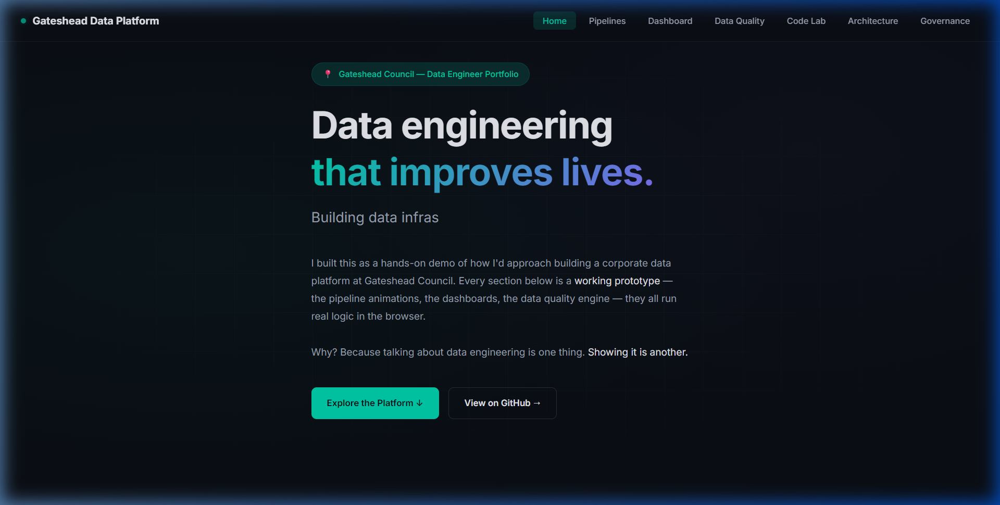
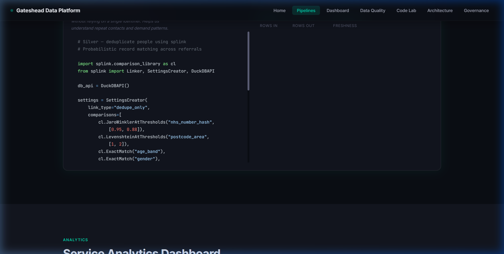
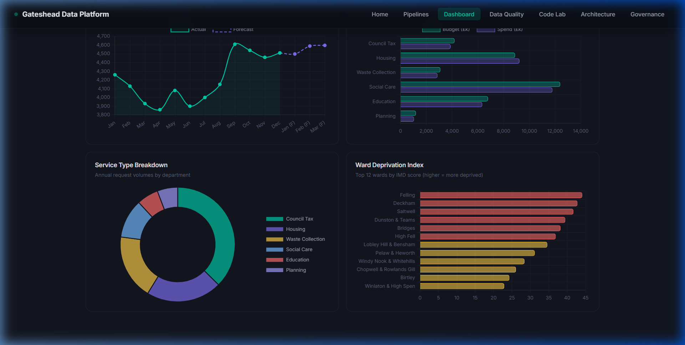
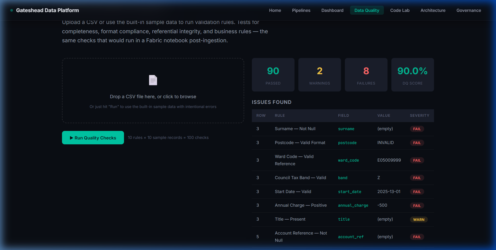
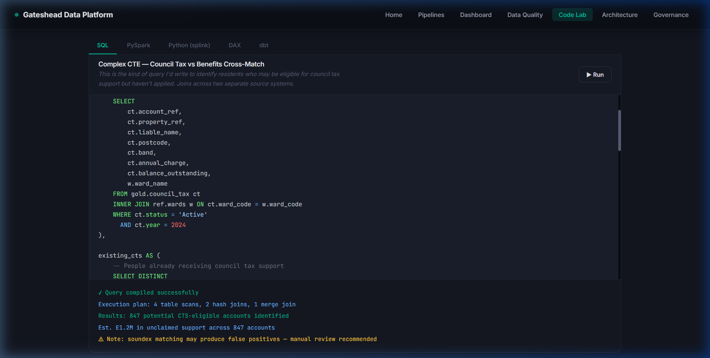
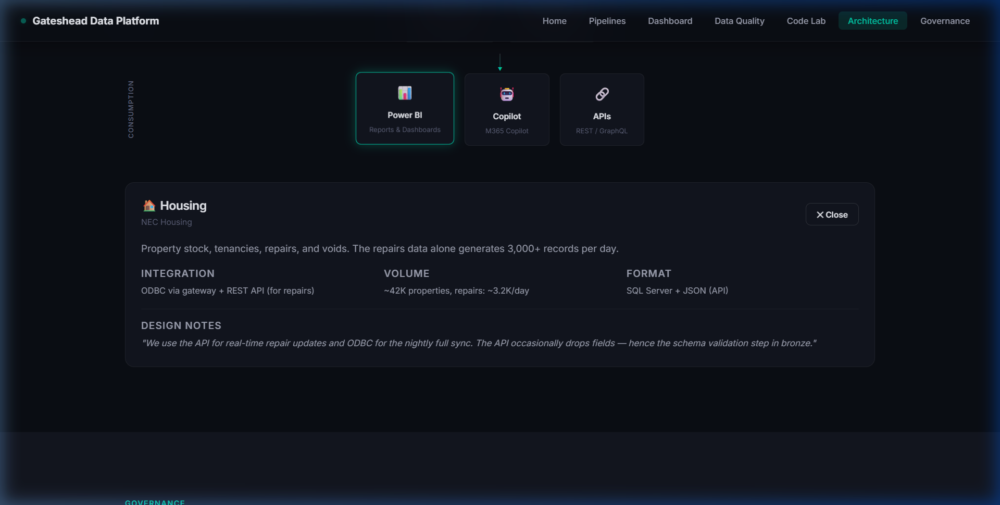
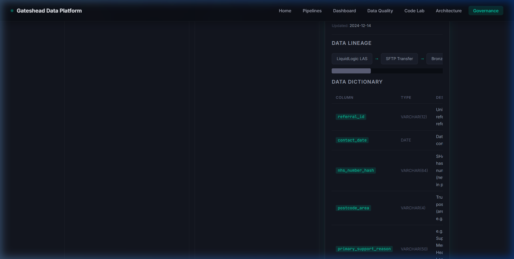

# Gateshead Data Platform — Portfolio Demo

A live, fully interactive showcase of a modern corporate data platform built specifically for Gateshead Council.

👉 **[View the live demo](https://angaarpotta.github.io/gateshead-data-platform/)**

## 📌 Project Overview
This repository contains a working, client-side simulation of a greenfield Microsoft Fabric corporate data platform. It shows how raw council data (Revenues, Housing, Social Care) can be ingested, validated, transformed, and modeled using a medallion architecture (Bronze/Silver/Gold) to deliver actionable insights that improve lives across Gateshead.

---

## 🛠️ Data Platform Showcases & Screenshots

### 1. Interactive Medallion Pipeline Builder
Demonstrates the design and execution of modular ETL pipelines.
*   **Fabric Equivalence**: Fabric Pipelines + Spark Notebooks.
*   **Skills shown**: PySpark DataFrame operations, standardizing postcodes, incremental loading with watermarks, and merging datasets (SCD Type 2).
*   **Action**: Click any stage to inspect the actual code and data volume metrics.

---

### 2. Service Analytics Dashboard
A high-fidelity dashboard built with Chart.js to simulate a Power BI implementation.
*   **Insights**: Service demand trends, 3-month linear regression forecasts, department budget vs. spend, and ward deprivation indexing using ONS IMD scores.
*   **Aesthetics**: Premium dark theme with matching teal/purple civic accent colors.

---

### 3. Data Quality (DQ) Engine
Simulates automated data validation run on raw ingestion.
*   **Rules**: 10 automated rules covering format validations, ONS ward code integrity, null checking, and boundary limits.
*   **Interface**: Interactive validation run showing an instant scorecard and issues table.

---

### 4. Code Laboratory
Tabbed showcase of enterprise-ready code templates written for typical local authority challenges:
*   **SQL**: Complex CTE query identifying residents eligible for Council Tax Support.
*   **PySpark**: Delta MERGE pattern for Slowly Changing Dimensions (SCD Type 2).
*   **splink**: Probabilistic record linkage model to deduplicate residents across multiple line-of-business apps without a common ID.
*   **DAX**: Rolling 3-month averages and YoY percentage measures.
*   **dbt**: Staging model schemas, constraints, and tests.

---

### 5. Microsoft Fabric Architecture Design
An interactive diagram showing the platform's multi-layered layout.
*   **Layers**: Data Sources ➔ Ingestion ➔ Storage (OneLake Medallion) ➔ Processing ➔ Serving ➔ Consumption (Power BI, Copilot, APIs).
*   **Detail**: Node clicks expand into design rationale and volume estimates.

---

### 6. Data Governance Catalog & Lineage
Maintains platform transparency, auditability, and data security.
*   **Components**: Searchable ONS dataset catalog, data lineage flows, data dictionary, GDPR privacy/PII flags, and retention policies.

---

## 💻 Tech Stack
*   **Frontend**: HTML5, Vanilla CSS3 (Custom design system), Modern JavaScript (ES Modules)
*   **Visualizations**: Chart.js 4
*   **Syntax Highlighting**: Prism.js (Tomorrow theme)
*   **Typography**: Google Fonts (Inter + JetBrains Mono)

---

## ⚠ Disclaimer
All data displayed or simulated in this application is entirely synthetic. No real resident records, ONS registers, or council tax data were used. System architecture decisions and mock scenarios are designed based on standard public-sector service datasets.

---
*Built to showcase modern engineering capability.*
